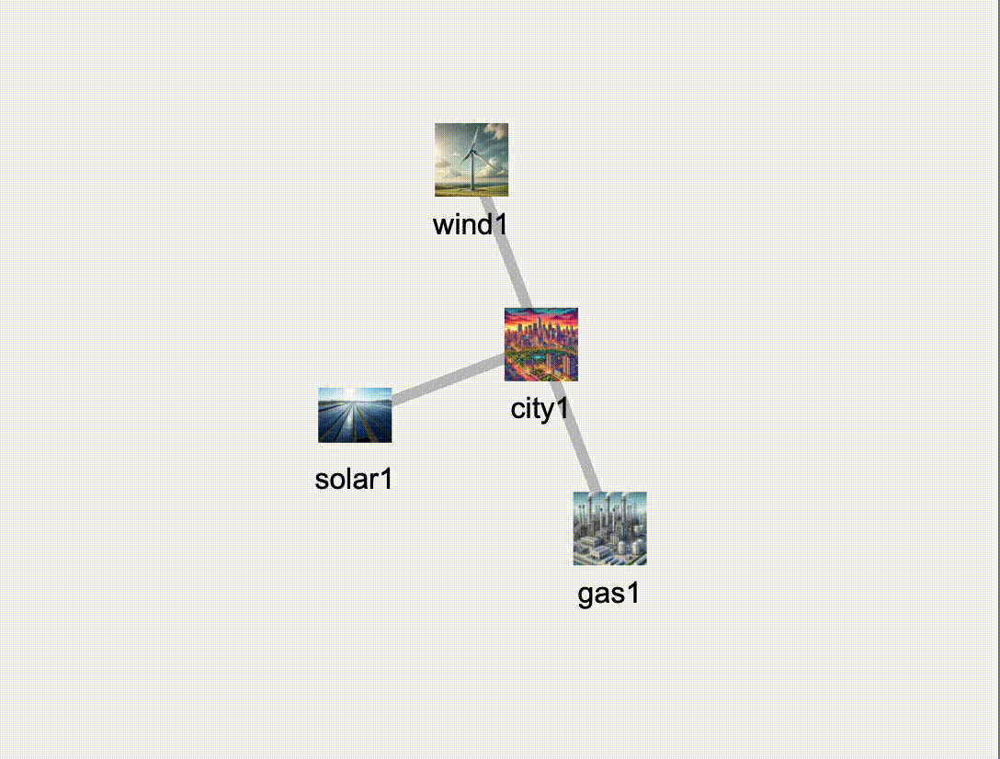

# Power Supply Network Optimization

## Alex Higginbottom, Oscar Hill, Michael Dodds, Hanlin Xiao

# Guide to the code

## Installation

To install our Python module, run:

`pip install --editable .`

## Get started

To run our optimisation procedure and view the results:

`python main/scripts/main.py`

## Documentation

To build the docs: `cd docs && bash construct.sh`.
The docs have already been built: just view the HTML files in `docs/build/html` by running `python -m http.server`

## Introduction

This project focuses on optimizing a power supply network between power sources and sinks. In reality, the connections between power plants and cities can be represented as a network, where edges denote the transmission routes of electricity.

A simplified model considers power plants as **sources** and cities as **sinks**, with transmission lines forming the network structure. The objective is to optimize the distribution of power to improve efficiency, minimize losses, and ensure stability. An example of this interconnected power supply graph is shown below.

---

## Dynamic Pricing and Supply Optimization

In real-world scenarios, the cost of power generation varies throughout the day for some energy sources. For example, **solar power** has a peak generation at noon but produces no power at midnight. If a city is connected to multiple sources, the optimization problem involves dynamically selecting the best energy supplier based on **time-dependent pricing**.

Additionally, the model incorporates **economic costs associated with insufficient power supply**. This introduces a trade-off between **minimizing supply costs** and **mitigating economic losses due to power shortages**.

For easier understanding, an example of the mathematical formulation of 2 x 2 cases is shown below. Note that this project would allow an easy scale up to much larger graphs than 2 x 2 and with a long time span.

---

## Mathematical Formulation (2x2 Case)

The optimization problem for a **two-sources, two-sinks** scenario is formulated as follows:

### **Power Constraints**
Each city's power demand must be met either through supplied power or be counted as unsatisfied demand:

$$
P_{11}(t) \times L(d_{11}) + P_{21}(t) \times L(d_{21}) + U_1(t) = P_{D1}(t)
$$

$$
P_{12}(t) \times L(d_{12}) + P_{22}(t) \times L(d_{22}) + U_2(t) = P_{D2}(t)
$$

Where:
- $P_{ij}(t)$ represents power supplied from source $i$ to city $j$.
- $L(d_{ij})$ represents transmission loss due to distance.
- $U_j(t)$ represents unsatisfied demand for city $j$.
- $P_{Dj}(t)$ is the total power demand of city $j$.

Each source has a maximum power generation capacity:

$$
P_{11}(t) + P_{12}(t) \leq P_{1T}(t)
$$

$$
P_{21}(t) + P_{22}(t) \leq P_{2T}(t)
$$

Where $P_{iT}(t)$ is the total power capacity of source $i$ at time $t$.

---

### **Cost Function**
The total cost to be minimized consists of two parts:
1. **Power generation cost:** Depends on the dynamically changing cost per unit power.
2. **Economic loss cost:** Associated with the unsatisfied demand.

$$
C_T(t) = C_1 + C_2 = k_1(t) (P_{11}(t) + P_{12}(t)) + k_2(t) (P_{21}(t) + P_{22}(t)) + E_1(t) U_1(t) + E_2(t) U_2(t)
$$

Where:
- $k_i(t)$ is the cost per unit power generated by source $i$.
- $E_j(t)$ is the economic loss coefficient for city $j$.

The objective function to minimize is:

$$
C_T(t) dt
$$

---

## Gradient Descent Formulation

Instead of solving a linear system directly, we reformulate this as a **gradient descent optimization** problem to improve scalability.

The final objective function includes:
1. **The total cost function** $C_T(t)$.
2. **Soft constraints as regularization terms**:
   - A regularization term for negative power supply (ensuring all supplied power values remain non-negative).
   - A regularization term for insufficient power supply (penalizing unsatisfied demand).

The gradient descent update steps iteratively adjust $P_{ij}(t)$ values to minimize this function while enforcing the constraints.

---

